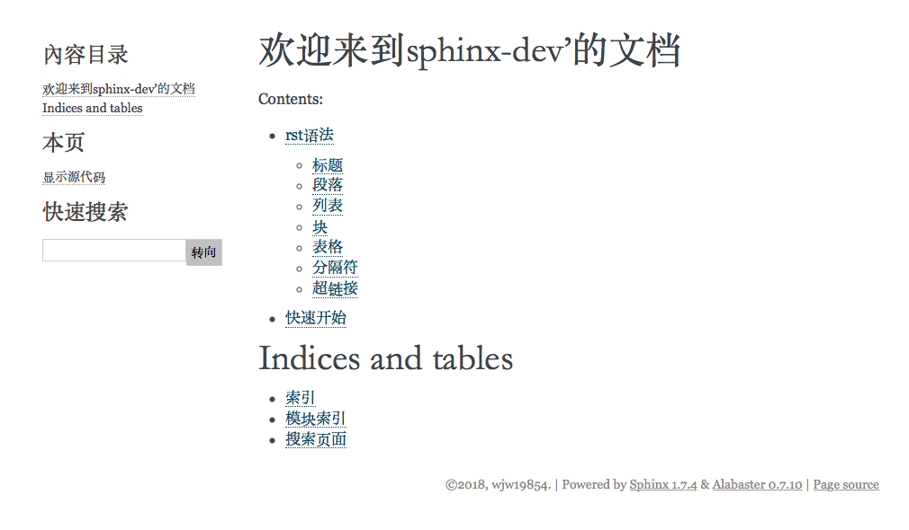

# sphinx-dev
sphinx文档工具学习

本项目所生成文档github pages地址为 https://wjw19854.github.io/sphinx-dev/ 效果如上图

其中详细介绍了sphinx文档工具,和本文档的生成方式

## 文件夹说明

`doc_source` sphinx文档源码目录.文档从这里生成 在此目录下执行`sh make.sh` 可以重新覆盖`docs`下的html文档

`docs` 生成的html目录文档,可以配合github pages 访问

这个版本的说明针对的*sphinx*版本号为*1.7.4*

## 感谢

* rst语法参考了 https://github.com/SeayXu 项目中的说明
